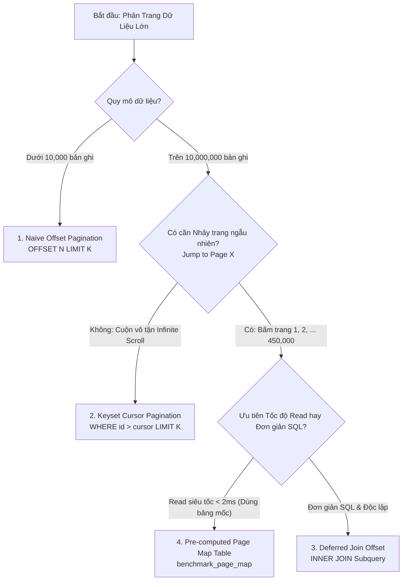

# ⚡ Module 1.1 — Database Pagination Suite (10M Rows)

> **Tập dữ liệu thử nghiệm**: 10,000,000 dòng (`benchmark_users`).

---

## 📊 1. Bảng So Sánh Hiệu Năng Phân Trang (Read Performance Matrix)

| # | Phương Pháp Phân Trang | Tốc Độ Read (10M Rows) | Độ Phức Tạp Thuật Toán (Formal vs Practical) | Khả Năng Nhảy Trang Ngẫu Nhiên | Đánh Giá Chung |
|:---:|:---:|:---:|:---:|:---:|:---:|
| 1 | **Naive Offset (`OFFSET 5M`)** | 🔴 `1,418.04 ms` | $\mathcal{O}(N)$ (Tuyến tính) | ✅ Có (Jump Page 1 -> 500k) | Sập DB khi Offset sâu > 100k dòng |
| 2 | **Optimized Keyset Cursor** | ⚡ `3.14 ms` | $\mathcal{O}(\log N)$ (B-Tree Seek) | ❌ Không (Chỉ Next/Prev) | Tối ưu tuyệt đối cho Infinite Scroll / Feed |
| 3 | **Deferred Join Offset** | 🟢 `12.50 ms` | $\mathcal{O}(\log N)$ (Index Subquery) | ✅ Có (Jump Page 1 -> 500k) | Tối ưu nhảy trang ngẫu nhiên cho bảng 100k - 5M dòng |
| 4 | **Pre-computed Page Map** | ⚡ `< 2.0 ms` | $\mathcal{O}(\log N)$ ($\approx$ Practical $\mathcal{O}(1)$) | ✅ Có (Jump Page 1 -> 500k) | Tối ưu nhảy trang ngẫu nhiên TMĐT (Shopee, Amazon) |

---

## 🌲 2. Sơ Đồ Cây Quyết Định (Decision Tree Flowchart)



---

## 🎯 3. Chi Tiết Từng Phương Pháp & Phân Tích Chuyên Sâu (Deep Dive)

### 📌 1. Naive Offset Pagination (`OFFSET 5M LIMIT 20`)
- **Cơ chế**: Dùng câu lệnh `OFFSET N LIMIT K` tiêu chuẩn.
- **Độ phức tạp**: $\mathcal{O}(N)$. Với 10 triệu bản ghi, `OFFSET 5,000,000` bắt buộc PostgreSQL phải đếm và bỏ qua 5 triệu dòng trước khi lấy 20 dòng.
- **Khi nào dùng**: Bảng nhỏ dưới **10,000 bản ghi** (Bảng danh mục, tỉnh thành, phòng ban).

---

### 📌 2. Keyset Cursor Pagination (`WHERE id > cursor LIMIT 20`)
- **Cơ chế**: Dùng con trỏ (Cursor là `id` của bản ghi cuối trang trước) để B-Tree Index Seek trực tiếp.
- **Độ phức tạp**: $\mathcal{O}(\log N)$. Chiều cao cây B-Tree cố định ($h \approx 3$), thời gian tìm kiếm `< 4 ms` ở mọi độ sâu trang.
- **Nhược điểm**: KHÔNG THỂ nhảy trang ngẫu nhiên (Ví dụ: nhảy từ Trang 1 sang Trang 500,000) vì chưa biết cursor của trang 499,999.
- **Khi nào dùng**: Các ứng dụng **Infinite Scroll / Newsfeed** (TikTok, Facebook, Twitter, Chat History, Log Stream).

---

### 📌 3. Deferred Join Offset Pagination (`INNER JOIN Subquery`)
- **Cơ chế**: Thực hiện `OFFSET` trên Primary Key `id` trong Subquery (Index Only Scan), sau đó JOIN lại với bảng chính.
- **Độ phức tạp**: $\mathcal{O}(\log N)$.
- **Lưu ý quan trọng khi có bộ lọc (`WHERE status = 'ACTIVE' AND age >= 25`)**:
  - Nếu **chưa có Covering Index `(status, age, id)`**, subquery vẫn phải lật đĩa Heap để lọc dữ liệu + tốn thêm chi phí phép toán Nested Loop Join, khiến nó có thể chậm hơn Naive Offset.
  - Khi **có Composite Index**, subquery đạt Index Only Scan 100% và chạy cực nhanh!
- **Khi nào dùng**: Nhảy trang ngẫu nhiên trên các bảng dữ liệu từ **100,000 đến 5,000,000 dòng**.

---

### 📌 4. Pre-computed Page Map Table (`benchmark_page_map`)
- **Bản chất**: Bản chất là một dạng **Materialized Index Lookup Table** kết hợp giữa Offset và Keyset Cursor.
- **Cơ chế 2 bước**:
  1. Tra bảng mốc `SELECT min_id FROM benchmark_page_map WHERE page_number = X` để đổi `page_number` $\rightarrow$ `cursor (min_id)`.
  2. Thực hiện Keyset Seek: `SELECT * FROM benchmark_users WHERE id >= min_id LIMIT 20`.
- **Độ phức tạp**:
  - **Lý thuyết Formal Big-O**: $\mathcal{O}(\log M + \log N) \approx \mathcal{O}(\log N)$.
  - **Thực thi thực tế (Practical Complexity)**: Chiều cao cây B-Tree cố định ($h = 3$), số lần đọc đĩa là hằng số ($c = 3\text{ I/Os}$) ở mọi trang $\rightarrow$ Đạt tốc độ **Practical Constant Time $\approx \mathcal{O}(1) < 2\text{ ms}$**.
- **Khi nào dùng**: Sàn **Thương Mại Điện Tử lớn (Shopee, Lazada, Amazon)** cần nhảy trang ngẫu nhiên trên 10 triệu sản phẩm.

---

## 🛠️ 4. Danh Sách API Endpoints (cURL Snippets)

### 1. Naive Offset Pagination (GET Filtered)
```bash
curl -s "http://localhost:3000/api/v1/db-pagination/naive/users?page=250000&limit=20&status=ACTIVE&minAge=10&maxAge=40"
```

### 2. Keyset Cursor Pagination (GET Filtered)
```bash
curl -s "http://localhost:3000/api/v1/db-pagination/optimized/users/keyset?cursor=5000000&limit=20&status=ACTIVE&minAge=10&maxAge=40"
```

### 3. Deferred Join Offset Pagination (GET Filtered)
```bash
curl -s "http://localhost:3000/api/v1/db-pagination/optimized/users/deferred-join?page=250000&limit=20&status=ACTIVE&minAge=10&maxAge=40"
```

### 4. Pre-computed Page Map Pagination (GET Filtered)
```bash
curl -s "http://localhost:3000/api/v1/db-pagination/optimized/users/page-map?page=250000&limit=20&status=ACTIVE&minAge=10&maxAge=40"
```

### 5. Refresh Pre-computed Page Map Table (POST)
```bash
curl -X POST "http://localhost:3000/api/v1/db-pagination/optimized/users/page-map/refresh?limit=20"
```

---

## 📜 5. SQL DDL & Page Map Refresh Script
File khởi tạo & cập nhật Bảng Mốc Bản Đồ Trang: `scripts/setup_benchmark_indexes.sql`

```sql
-- Lệnh SQL Atomic Upsert Rebuild Bảng Mốc Bản Đồ Trang Page Map (Dùng cho Cronjob / Background Worker)
INSERT INTO benchmark_page_map (page_number, min_id)
SELECT ceil(row_num / 20.0)::int AS page_number, min(id) AS min_id
FROM (
    SELECT id, ROW_NUMBER() OVER (ORDER BY id ASC) AS row_num
    FROM benchmark_users
) AS tmp
GROUP BY ceil(row_num / 20.0)
ON CONFLICT (page_number) 
DO UPDATE SET min_id = EXCLUDED.min_id;
```
